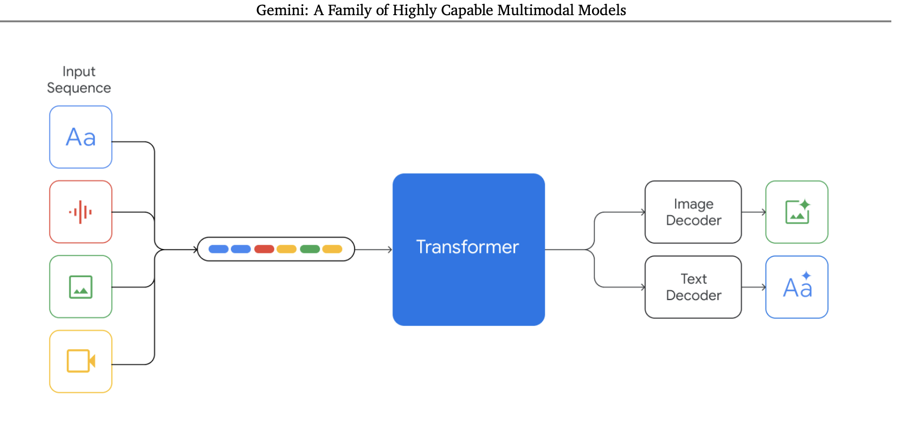

[](https://discord.gg/qUtxnK2NMf)

# Gemini



The open source implementation of Gemini, the model that will "eclipse ChatGPT", it seems to work by directly taking in all modalities all at once into a transformer with special decoders for text or img generation!

[Join the Agora discord channel to help with the implementation!](https://discord.gg/CMDpRxCV8g) and [Here is the project board:](https://github.com/users/kyegomez/projects/11/views/1)

The input sequences for Gemini consist of texts, audio, images, and videos. These inputs are transformed into tokens, which are then processed by a transformer. Subsequently, conditional decoding takes place to generate image outputs. Interestingly, the architecture of Gemini bears resemblance to Fuyu's architecture but is expanded to encompass multiple modalities. Instead of utilizing a visual transformer (vit) encoder, Gemini simply feeds image embeddings directly into the transformer. For Gemini, the token inputs will likely be indicated by special modality tokens such as [IMG], , [AUDIO], or <audio>. Codi, a component of Gemini, also employs conditional generation and makes use of the tokenized outputs. To implement this model effectively, I intend to initially focus on the image embeddings to ensure their smooth integration. Subsequently, I will proceed with incorporating audio embeddings and then video embeddings.

# Install
`pip3 install gemini-torch`


## Usage

### Gemini Transformer Usage
- Base transformer
- Multi Grouped Query Attn / flash attn
- rope
- alibi
- xpos
- qk norm
- no pos embeds
- kv cache

```python
import torch

from gemini_torch.model import Gemini

# Initialize model with smaller dimensions
model = Gemini(
    num_tokens=50432,
    max_seq_len=4096,  # Reduced from 8192
    dim=1280,  # Reduced from 2560
    depth=16,  # Reduced from 32
    dim_head=64,  # Reduced from 128
    heads=12,  # Reduced from 24
    use_abs_pos_emb=False,
    attn_flash=True,
    attn_kv_heads=2,
    qk_norm=True,
    attn_qk_norm=True,
    attn_qk_norm_dim_scale=True,
)

# Text shape: [batch, seq_len, dim]
text = torch.randint(0, 50432, (1, 4096))  # Reduced seq_len from 8192

# Apply model to text
y = model(
    text,
)

# Output shape: [batch, seq_len, dim]
print(y)
```
--------

### Full Multi-Modal Gemini 
- Processes images and audio through a series of reshapes
- Ready to train for production grade usage
- Hyper optimized with flash attention, qk norm, and other methods

```python
import torch

from gemini_torch.model import Gemini

# Initialize model with smaller dimensions
model = Gemini(
    num_tokens=10000,  # Reduced from 50432
    max_seq_len=1024,  # Reduced from 4096
    dim=320,  # Reduced from 1280
    depth=8,  # Reduced from 16
    dim_head=32,  # Reduced from 64
    heads=6,  # Reduced from 12
    use_abs_pos_emb=False,
    attn_flash=True,
    attn_kv_heads=2,
    qk_norm=True,
    attn_qk_norm=True,
    attn_qk_norm_dim_scale=True,
    post_fusion_norm=True,
    post_modal_transform_norm=True,
)

# Text shape: [batch, seq_len, dim]
text = torch.randint(0, 10000, (1, 1024))  # Reduced seq_len from 4096

# Img shape: [batch, channels, height, width]
img = torch.randn(1, 3, 64, 64)  # Reduced height and width from 128

# Audio shape: [batch, audio_seq_len, dim]
audio = torch.randn(1, 32)  # Reduced audio_seq_len from 64

# Apply model to text and img
y, _ = model(text=text, img=img, audio=audio)

# Output shape: [batch, seq_len, dim]
print(y)
print(y.shape)


# After much training
model.eval()

text = tokenize(texts)
logits = model(text)
text = detokenize(logits)
```
------


## LongGemini
An implementation of Gemini with Ring Attention, no multi-modality processing yet.

```python
import torch
from gemini_torch import LongGemini

# Text tokens
x = torch.randint(0, 10000, (1, 1024))

# Create an instance of the LongGemini model
model = LongGemini(
    dim=512,  # Dimension of the input tensor
    depth=32,  # Number of transformer blocks
    dim_head=128,  # Dimension of the query, key, and value vectors
    long_gemini_depth=9,  # Number of long gemini transformer blocks
    heads=24,  # Number of attention heads
    qk_norm=True,  # Whether to apply layer normalization to query and key vectors
    ring_seq_size=512,  # The size of the ring sequence
)

# Apply the model to the input tensor
out = model(x)

# Print the output tensor
print(out)

```


## Tokenizer
- Sentencepiece, tokenizer
- We're using the same tokenizer as LLAMA with special tokens denoting the beginning and end of the multi modality tokens.
- Does not fully process img, audio, or videos now we need help on that

```python
from gemini_torch.tokenizer import MultimodalSentencePieceTokenizer

# Example usage
tokenizer_name = "hf-internal-testing/llama-tokenizer"
tokenizer = MultimodalSentencePieceTokenizer(tokenizer_name=tokenizer_name)

# Encoding and decoding examples
encoded_audio = tokenizer.encode("Audio description", modality="audio")
decoded_audio = tokenizer.decode(encoded_audio)

print("Encoded audio:", encoded_audio)
print("Decoded audio:", decoded_audio)
```


# References
* Combine Reinforcment learning with modular pretrained transformer, multi-modal capabilities, image, audio, 
* self improving mechanisms like robocat
* PPO? or MPO
* get good at backtracking and exploring alternative paths
* speculative decoding
* Algorithm of Thoughts
* RLHF
* [Gemini Report](https://storage.googleapis.com/deepmind-media/gemini/gemini_1_report.pdf)
* [Gemini Landing Page](https://deepmind.google/technologies/gemini/#introduction)


# Todo

- [ ] [Check out the project board for more todos](https://github.com/users/kyegomez/projects/11/views/1)


- [x] Implement the img feature embedder and align imgs with text and pass into transformer: ```Gemini models are trained to accommodate textual input interleaved with a wide variety of audio and visual inputs, such as natural images, charts, screenshots, PDFs, and videos, and they can produce
text and image outputs (see Figure 2). The visual encoding of Gemini models is inspired by our own
foundational work on Flamingo (Alayrac et al., 2022), CoCa (Yu et al., 2022a), and PaLI (Chen et al.,
2022), with the important distinction that the models are multimodal from the beginning and can
natively output images using discrete image tokens (Ramesh et al., 2021; Yu et al., 2022b).```

- [x] Implement the audio processing using USM by Google:```In addition, Gemini can directly ingest audio signals at
16kHz from Universal Speech Model (USM) (Zhang et al., 2023) features. This enables the model to
capture nuances that are typically lost when the audio is naively mapped to a text input (for example,
see audio understanding demo on the website).```


- [ ] Video Processing Technique: "
Video understanding is accomplished by encoding the video as a sequence of frames in the large
context window. Video frames or images can be interleaved naturally with text or audio as part of the
model input"

- [ ] Prompting Technique: ``` We find Gemini Ultra achieves highest
accuracy when used in combination with a chain-of-thought prompting approach (Wei et al., 2022)
that accounts for model uncertainty. The model produces a chain of thought with k samples, for
example 8 or 32. If there is a consensus above a preset threshold (selected based on the validation
split), it selects this answer, otherwise it reverts to a greedy sample based on maximum likelihood
choice without chain of thought. We refer the reader to appendix for a detailed breakdown of how
this approach compares with only chain-of-thought prompting or only greedy sampling.```


- [ ] Train a 1.8B + 3.25 Model: ```Nano-1 and Nano-2 model sizes are only 1.8B and 3.25B
parameters respectively. Despite their size, they show exceptionally strong performance on factuality,
i.e. retrieval-related tasks, and significant performance on reasoning, STEM, coding, multimodal and```
